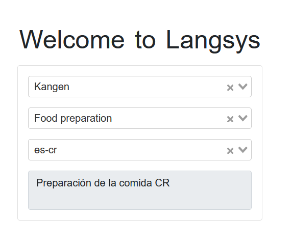

# Frontend LangSys

Este proyecto implementa la solución del lado del frontend utilizando Vue.js. Permite mostrar traducciones dinámicas en diferentes idiomas y regiones, interactuando con un endpoint de API desarrollado en Laravel.

## Requisitos Previos

Asegúrate de tener instalado lo siguiente antes de comenzar:

- Node.js (versión 14 o superior)
- npm

## Pasos para Levantar el Proyecto

Sigue estos pasos para configurar y ejecutar el proyecto en tu entorno local:

1. Clona el repositorio:
   ```bash
   git clone https://github.com/tu_usuario/tu_repositorio.git

    Navega a la carpeta del proyecto:

cd tu_repositorio

Instala las dependencias:

npm install

Inicia el servidor de desarrollo:

    npm run dev

Estructura del Proyecto

En la carpeta src/ encontrarás la siguiente estructura:

src/
├── components/ # Contiene todos los componentes de Vue
│   └── LangComponent.vue # Componente que contiene la solución
├── services/ # Archivos para interactuar con la API
│   └── api.js # Archivo con las peticiones a la API
└── ...

Descripción de Componentes y Servicios

    LangComponent.vue: Este componente incluye la lógica principal para interactuar con la API y mostrar las traducciones dinámicas.
    api.js: Este archivo contiene todas las funciones para realizar peticiones a la API del backend.

Funcionalidad en el Frontend

El frontend utiliza el endpoint de la API para mostrar traducciones dinámicas en diferentes idiomas y regiones. A continuación, se explica cómo funciona:

    Selección de idioma y región:
        Un usuario selecciona un idioma y región específicos, por ejemplo, es-cr (español de Costa Rica).

    Solicitud al endpoint de la API:
        El frontend realiza una solicitud al endpoint de la API con los siguientes parámetros:
            project_id: ID del proyecto.
            token_id: ID del token que se desea traducir.
            locale: Código del locale seleccionado por el usuario (por ejemplo, es-cr).

    Respuesta de la API:
        Si la traducción existe para el locale seleccionado, se devuelve la traducción correspondiente y se muestra en la interfaz.
        Si no existe una traducción para el locale seleccionado, se devuelve la traducción en el locale predeterminado (es-es).
        Si no hay ninguna traducción disponible, se devuelve un mensaje de error indicando que la traducción no está disponible.

    Visualización en la interfaz:
        Si la traducción existe, se muestra en la interfaz del usuario.
        Si no hay traducción disponible, se muestra un mensaje de error en la interfaz para informar al usuario.

Ejemplo de Uso

    El usuario selecciona el locale es-cr en la interfaz.
    El frontend envía una solicitud a la API con los parámetros:
        project_id: 1
        token_id: 2
        locale: es-cr
    La API responde con la traducción correspondiente o, en su defecto, con la traducción en el locale predeterminado (es-es).
    El frontend muestra la traducción en la interfaz.

Comportamiento de Fallback

    Si el locale solicitado no tiene una traducción específica, el sistema utiliza el locale predeterminado (es-es).
    Si no hay traducción disponible para ningún locale, se muestra un mensaje de error: "Translation not available."

Vista de la Interfaz

A continuación, se muestra una imagen de cómo se ve la interfaz del frontend: 


Ahora puedes copiar todo el contenido y pegarlo directamente en tu archivo `README.md`.
